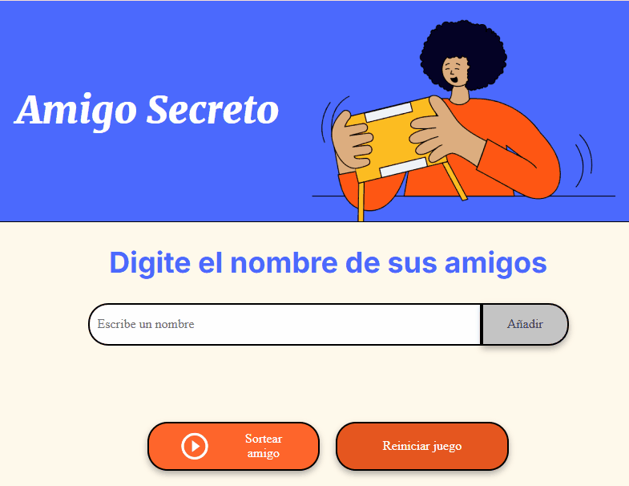

<h1 align="center"> Challenge Amigo Secreto </h1>
<em> # 1º Challenge - Alura Latam / Oracle - ONE Grupo 8</em>

## Descripción

El proyecto "Amigo Secreto" es una aplicación web simple que permite a los usuarios ingresar una lista de nombres y sortear aleatoriamente un "amigo secreto" sin repetir nombres hasta que todos hayan sido seleccionados. Es ideal para organizar sorteos en reuniones, fiestas o eventos.

## Funcionalidades principales

- **Ingreso dinámico de nombres**: Los usuarios pueden agregar nombres a través de un campo de texto.
- **Sorteo aleatorio**: Al hacer clic en el botón "Sortear amigo", se selecciona un nombre al azar de la lista sin repetir.
- **Visualización de resultados**: Los nombres sorteados se muestran en una lista separada.
- **Reinicio del juego**: Se puede reiniciar el juego para comenzar desde cero.

## Instrucciones de instalación

Este proyecto no requiere instalación especial. Simplemente descarga los archivos y ábrelos en tu navegador.

1. Clona este repositorio o descarga los archivos.
2. Abre el archivo `index.html` en tu navegador preferido.
3. Utiliza Live Server para abrir al juego.

## Instrucciones de uso

1. **Agregar nombres**:
   - Escribe un nombre en el campo de texto debajo de "Digite el nombre de sus amigos".
   - Haz clic en el botón "Añadir" para agregar el nombre a la lista.

2. **Sortear un amigo**:
   - Una vez que hayas agregado todos los nombres, haz clic en el botón "Sortear amigo".
   - El nombre sorteado aparecerá en la lista de resultados.

3. **Reiniciar el juego**:
   - Si deseas comenzar de nuevo, haz clic en el botón "Reiniciar juego". Esto limpiará todas las listas y permitirá volver a empezar.

## Video de ejemplo

*Video de ejemplo de la interfaz del juego.*

## Tecnologías utilizadas

- **HTML**: Estructura básica de la página.
- **CSS**: Estilos visuales y diseño responsivo.
- **JavaScript**: Lógica del juego, como el ingreso de nombres, el sorteo aleatorio y la gestión de listas.

## Contribuciones

Este proyecto es de código abierto. Si deseas contribuir, sigue estos pasos:

1. Haz un fork del repositorio.
2. Crea una nueva rama (`git checkout -b feature/nueva-funcionalidad`).
3. Realiza tus cambios y haz commit (`git commit -m "Añadir nueva funcionalidad"`).
4. Sube tus cambios (`git push origin feature/nueva-funcionalidad`).
5. Envía un pull request.

## Autor

- **Paola Bastida** - [Enlace a tu perfil de GitHub](https://github.com/tu-usuario)

## Licencia

Este proyecto está bajo la licencia MIT. Consulta el archivo [LICENSE](LICENSE) para más detalles.
